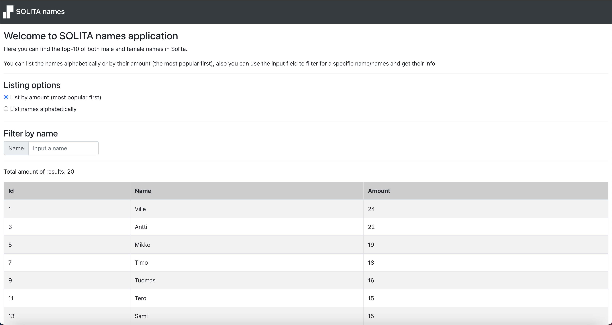
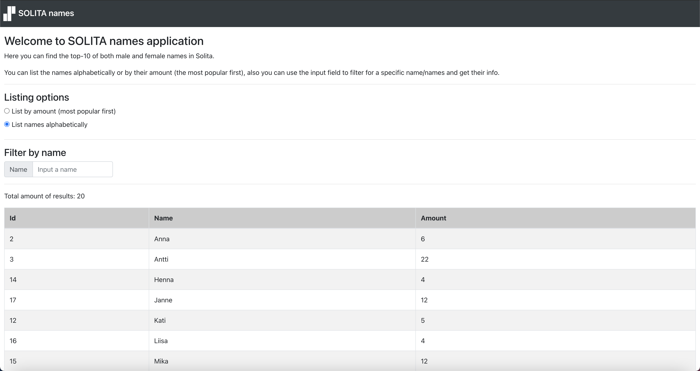
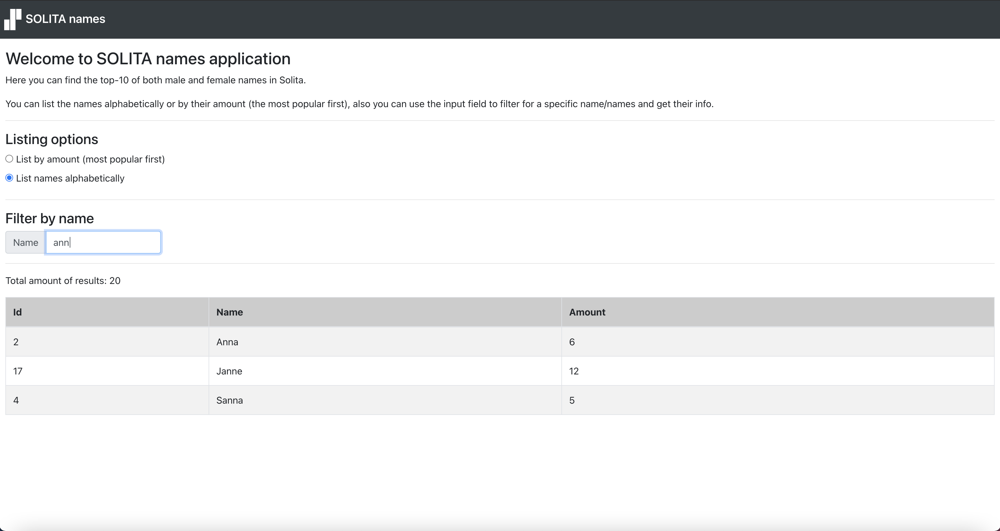

<h1 align="center">Welcome to SOLITA names 👋</h1>

> SOLITA names app lists the top-10 of both male and female names in Solita.

## Used technologies:
- React
- Bootstrap

## How to use:

Clone the app and run it from your IDE. <br />
 
### Install:

```sh
npm install
```

### Server:

I used JSON server to act as a server, after installation you can do:

```sh
npx json-server --port 3001 --watch names.json
```

## Images
### List by amount (the most popular first) 


### List names alphabetically


### Filter by name 


## Author:

👤 **Abdullah Hinnawi**
- [Portfolio](https://abdullahhinnawi.com/)
- [Linkedin](https://www.linkedin.com/in/abdullah-hinnawi-426465198/)
- [GitHub](https://github.com/abdullahHinnawi)
